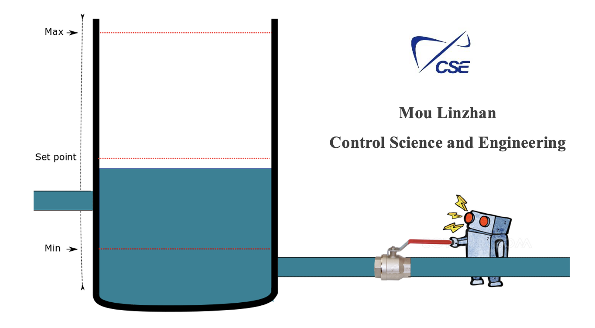

# Reinforcement Learning in Control System



## 1 About it

The project aimes to determine if machine learning's RL method could replace traditional controllers such as P-controller and MPC in industrial systems. The objective is to test the viability of using an RL algorithm for controlling an industrial system, making it more of a proof-of-concept study.


The motivation is that some large complex industrial systems have have model sequations which need to be solved in order to have a control-model. And the solution is based on the system equations. Sometime the solution is hard to converge and solve. So this project was to figure out if one could give the system to the Machine, without any knowledge about the system and see if it could learn to control the systemstate given an disturbance to the system.

## 2 Installation
Run the following to install requirements for the project.
```bash
pip install -r requirements.txt
```

## 3 Run
To run each project, execute **main.py**. Each project is independent of the others. To modify parameters, adjust the values in **params.py**. The **evalv_controller.py** script runs one episode using **disturbance_200.csv** and generates plots of valve position, liquid level, and disturbance history for comparing different controllers.